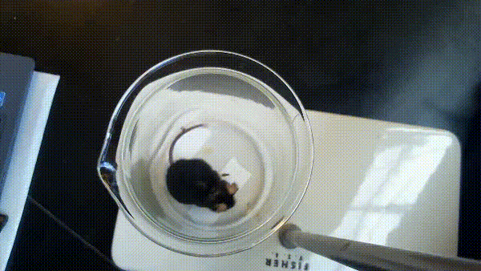
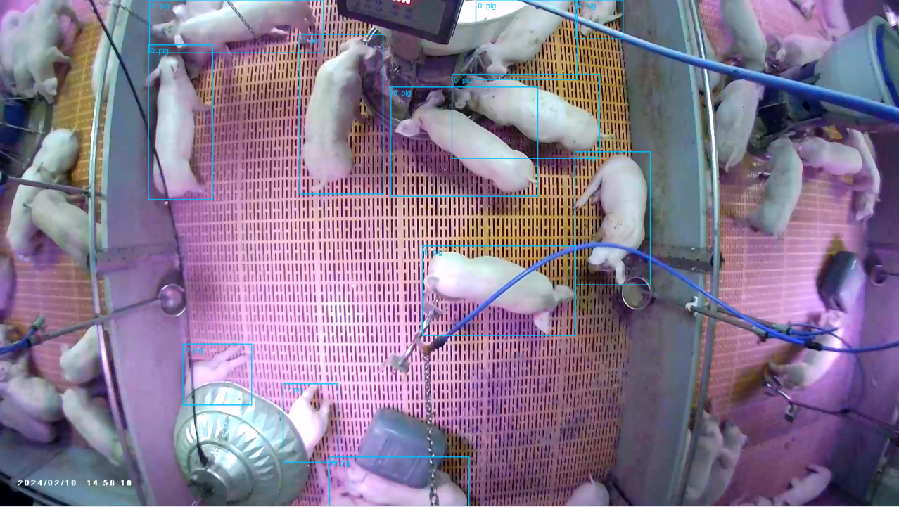

# CoreSight
AI Agent for Quantitative Video Analysis

## Overview
This technology is a specialized video analysis AI Agent designed to quantitatively analyze quantities, movements, and interactions of objects in various visual situations. While existing VLMs for video analysis show strengths in semantic understanding and description generation of images/videos, they have limitations in quantitative situational judgment such as object counting, multi-object tracking, attribute comparison, and causal relationship inference. This technology overcomes these limitations and realizes quantitative visual-language analysis with a low-cost structure capable of real-time processing.

## Key Features
- Natural language-based object counting (e.g., "How many people are standing in line?")
- Multi-object tracking and change detection (e.g., "Which direction are people moving?")
- Time-based causal relationship inference (e.g., "After which event did the number of vehicles increase?")
- Attribute comparison and anomaly detection (e.g., "Who moved the fastest?")
- High-speed lightweight inference with reduced GPU dependency

## 1. Rat Analysis

### Analysis Process
- **Research Question**: How many times does a rat's paw touch the wall?
- **VP Detector**: Implemented few-shot learning with minimal data to extract embeddings (10 samples)

- **Object Tracker**: Log extraction
- **LLM**: Chat-based analysis methodology development

Q: A rat is placed inside a flask. I need to find instances where the rat's paw hits the wall. What would be a good approach for analysis?

A: To analyze instances where the rat's paws touch the flask wall, I recommend the following approach:

1. **Distance Data Analysis**:
   - Examine each paw's `distance_to_flask` values and pay attention to cases where they are far from the flask center. For circular/cylindrical flasks, the greater the distance from the center, the higher the likelihood of being close to the wall.
   - Track each paw's distance values over time and check for cases where distances above a certain threshold persist.

2. **Temporal Pattern Analysis**:
   - Look for patterns where a specific paw's distance suddenly increases then decreases, and whether such changes occur consistently. This could indicate wall-hitting behavior.
   - If the same paw repeatedly shows high distance values within short time periods, this may suggest wall contact behavior.

3. **Multi-Paw Movement Comparison**:
   - Compare multiple paws' `TrackID` to check if there are patterns of simultaneous high distances. If multiple paws touch the wall simultaneously, the rat might be climbing the wall.

4. **Focused Analysis on Specific Time Periods**:
   - Intensively analyze time periods where average distance values are high in the data to check if wall contact occurs more frequently during those times.

5. **Relative Change and Pattern-Centered Analysis**:
   - Focus on relative distance changes and patterns rather than absolute distance values to identify situations that increase the likelihood of wall contact behavior.

Q: Sort by probability from highest when using only maximum distance

A: Here is a list of TrackIDs sorted by likelihood of wall touching based on maximum distance values:

1. **ID 5:**
   - Time Period: Time Period 1 (00:00:06.862 to 00:00:34.277)
   - Maximum Distance: 243.3px
2. **ID 4:**
   - Time Period: Time Period 1 (00:00:06.862 to 00:00:34.277)
   - Maximum Distance: 214.3px
3. **ID 9:**
   - Time Period: Time Period 1 (00:00:06.862 to 00:00:34.277)
   - Maximum Distance: 214.9px
4. **ID 58:**
   - Time Period: Time Period 14 (00:07:20.253 to 00:07:36.789)
   - Maximum Distance: 213.3px
5. **ID 3:**
   - Time Period: Time Period 1 (00:00:06.862 to 00:00:34.277)
   - Maximum Distance: 204.2px
6. **ID 26:**
   - Time Period: Time Period 18 (00:09:06.902 to 00:09:19.957)
   - Maximum Distance: 197.0px
7. **ID 38:**
   - Time Period: Time Period 13 (00:06:08.484 to 00:06:32.418)
   - Maximum Distance: 193.1px
8. **ID 32:**
   - Time Period: Time Period 13 (00:06:08.484 to 00:06:32.418)
   - Maximum Distance: 191.5px
9. **ID 60:**
   - Time Period: Time Period 17 (00:08:36.875 to 00:09:06.835)
   - Maximum Distance: 191.9px
10. **ID 44:**
    - Time Period: Time Period 13 (00:06:08.484 to 00:06:32.418)
    - Maximum Distance: 191.2px

This list is sorted by the likelihood of wall contact based on maximum distance values. Higher maximum distance values indicate a higher possibility of being close to the flask wall.

**Highlight Videos:**

<table>
<tr>
<td align="center">

 
<b>Highlight Sample 01</b>
</td>
<td align="center">

 
<b>Highlight Sample 02</b>
</td>
</tr>
</table>

## 2. Pig Analysis

### Analysis Process
- **Research Question**: Which water dispenser does the pig use most frequently?
- **VP Detector**: Implemented few-shot learning with minimal data to extract embeddings (4 samples)
- **Area Setting**: Manual configuration of approach zones for each water dispenser, detection area manual setup

<table>
<tr>
<td align="center">

 
<b>Pig Labeling</b>
</td>
<td align="center">

 
<b>Water Dispenser & Detection Area Setup</b>
</td>
</tr>
</table>

- **Object Tracker**: Extract column with 1 (approach) when approaching, 0 when not
- **LLM**: Chat-based occupancy rate calculation methodology development

Q: Among the 4 water dispensers, which water dispenser do pigs use most frequently? Calculate by occupancy rate and produce results

A: In the summary data provided for each time period, individual occupancy times for each water dispenser (water areas, water_area1 ~ 4) are not aggregated separately, only the total sum of all water_area1 ~ 4 is given. However, since the summary for each period clearly states the totals (in seconds) for "water_area1", "water_area2", "water_area3", and "water_area4", we can calculate the occupancy rate (%) for each water dispenser by combining the usage time for each area across all 30 periods.

### Time Usage Aggregation by Water Dispenser (Rounded)

### Water Dispenser 1 (water_area1)
- Sum of water_area1 for periods 1-30:
- 36.51 + 39.57 + 0 + 0.37 + 243.04 + 165.99 + 0.10 + 90.48 + 36.97 + 374.06 + 362.86 + 12.94 + 25.04 + 0.03 + 52.21 + 304.12 + 166.19 + 122.35 + 57.54 + 314.95 + 356.56 + 313.05 + 330.29 + 226.70 + 164.09 + 373.69 + 0.43 + 371.43 + 111.02 + 201.80

### Water Dispenser 2 (water_area2)
- 12.14 + 2.47 + 81.21 + 0 + 46.04 + 55.78 + 48.51 + 6.27 + 94.28 + 108.92 + 1.23 + 4.13 + 80.65 + 56.91 + 185.56 + 22.94 + 34.51 + 118.35 + 19.87 + 142.29 + 79.61 + 40.91 + 190.80 + 49.71 + 18.64 + 352.12 + 213.40 + 273.28 + 105.88 + 18.17

### Water Dispenser 3 (water_area3)
- 2293.41 + 2377.85 + 1418.50 + 1580.62 + 2076.20 + 899.18 + 991.56 + 1135.35 + 2138.58 + 2383.95 + 1854.87 + 1356.95 + 2380.99 + 2182.72 + 1639.20 + 2155.78 + 2741.95 + 1827.73 + 2074.67 + 2109.88 + 2314.21 + 2116.24 + 2533.98 + 2280.64 + 1667.64 + 2386.36 + 2386.36 + 2322.88 + 2174.79 + 2132.38 + 1080.11

### Water Dispenser 4 (water_area4)
- 23.37 + 86.45 + 10.74 + 8.03 + 138.36 + 45.54 + 1.53 + 0.47 + 73.11 + 311.38 + 601.83 + 1000.16 + 495.75 + 34.81 + 91.28 + 15.47 + 32.47 + 195.27 + 204.93 + 170.63 + 148.92 + 248.87 + 150.06 + 591.60 + 108.72 + 194.36 + 383.86 + 754.36 + 1010.16 + 39.54

### Total Calculation (Rounded)

#### 1. Total Sum Calculation
- Dispenser 1: 36.51 + 39.57 + 0 + 0.37 + 243.04 + 165.99 + 0.10 + 90.48 + 36.97 + 374.06 + 362.86 + 12.94 + 25.04 + 0.03 + 52.21 + 304.12 + 166.19 + 122.35 + 57.54 + 314.95 + 356.56 + 313.05 + 330.29 + 226.70 + 164.09 + 373.69 + 0.43 + 371.43 + 111.02 + 201.80 = **5111 seconds**
- Dispenser 2: 12.14 + 2.47 + 81.21 + 0 + 46.04 + 55.78 + 48.51 + 6.27 + 94.28 + 108.92 + 1.23 + 4.13 + 80.65 + 56.91 + 185.56 + 22.94 + 34.51 + 118.35 + 19.87 + 142.29 + 79.61 + 40.91 + 190.80 + 49.71 + 18.64 + 352.12 + 213.40 + 273.28 + 105.88 + 18.17 = **2877 seconds**
- Dispenser 3: 2293.41 + 2377.85 + 1418.50 + 1580.62 + 2076.20 + 899.18 + 991.56 + 1135.35 + 2138.58 + 2383.95 + 1854.87 + 1356.95 + 2380.99 + 2182.72 + 1639.20 + 2155.78 + 2741.95 + 1827.73 + 2074.67 + 2109.88 + 2314.21 + 2116.24 + 2533.98 + 2280.64 + 1667.64 + 2386.36 + 2386.36 + 2322.88 + 2174.79 + 2132.38 + 1080.11 = **56406 seconds**
- Dispenser 4: 23.37 + 86.45 + 10.74 + 8.03 + 138.36 + 45.54 + 1.53 + 0.47 + 73.11 + 311.38 + 601.83 + 1000.16 + 495.75 + 34.81 + 91.28 + 15.47 + 32.47 + 195.27 + 204.93 + 170.63 + 148.92 + 248.87 + 150.06 + 591.60 + 108.72 + 194.36 + 383.86 + 754.36 + 1010.16 + 39.54 = **8543 seconds**
- Total: 5111 + 2877 + 56406 + 8543 = **72937 seconds**

#### 2. Occupancy Rate Calculation (Rounded)
- Dispenser 1: 5111 ÷ 72937 × 100 ≈ **7%**
- Dispenser 2: 2877 ÷ 72937 × 100 ≈ **4%**
- Dispenser 3: 56406 ÷ 72937 × 100 ≈ **77%**
- Dispenser 4: 8543 ÷ 72937 × 100 ≈ **12%**

#### Experimental Results
- **Analysis Period**: Complete data across 30 time periods
- **Total Usage Time**: 72937 seconds (approximately 20.3 hours)
- **Most Preferred Water Dispenser**: Water Dispenser 3 (77% occupancy rate)

**Summary Results:**

**Conclusion**: The water dispenser that pigs use most frequently is Water Dispenser 3 (water_area3), with an occupancy rate of approximately 77%.

Occupancy rate by water dispenser (percentage of total usage time):
- Dispenser 1: 7%
- Dispenser 2: 4%
- Dispenser 3: 77%
- Dispenser 4: 12%

**Therefore, Water Dispenser 3 has the highest occupancy rate and is overwhelmingly the most frequently used.**

Q: Can you find points where water consumption activity changed dramatically relative to other periods? Which time periods were these?

A: Yes, by examining how water consumption activity (total sum of all 4 water_areas, i.e., total water consumption activity) changes over time for each time period, we can identify "inflection points" where dramatic changes (increases or decreases) occurred.

### Total Water Consumption Time by Period (4 dispensers combined, rounded)

| Period | Total Water Activity (seconds) |
| --- | --- |
| 1 | 36+12+2293+23 = **2364** |
| 2 | 40+2+2378+86 = **2506** |
| 3 | 0+81+1418+11 = **1510** |
| 4 | 0+0+1581+8 = **1589** |
| 5 | 243+46+2076+138 = **2503** |
| 6 | 166+56+899+46 = **1167** |
| 7 | 0+49+992+2 = **1043** |
| 8 | 90+6+1135+0 = **1231** |
| 9 | 37+94+2139+73 = **2343** |
| 10 | 374+109+2384+311 = **3178** |
| 11 | 363+1+1855+602 = **2821** |
| 12 | 13+4+1357+1000 = **2374** |
| 13 | 25+81+2381+496 = **2983** |
| 14 | 0+57+2183+35 = **2275** |
| 15 | 52+186+1639+91 = **1968** |
| 16 | 304+23+2156+15 = **2498** |
| 17 | 166+35+2742+32 = **2975** |
| 18 | 122+118+1828+195 = **2263** |
| 19 | 58+20+2075+205 = **2358** |
| 20 | 315+142+2110+171 = **2738** |
| 21 | 357+80+2314+149 = **2900** |
| 22 | 313+41+2116+249 = **2719** |
| 23 | 330+191+2534+150 = **3205** |
| 24 | 227+50+2281+592 = **3149** |
| 25 | 164+19+1668+109 = **1960** |
| 26 | 374+352+2386+194 = **3306** |
| 27 | 1+213+2323+384 = **2921** |
| 28 | 371+273+2175+754 = **3573** |
| 29 | 111+106+2132+1010 = **3359** |
| 30 | 202+18+1080+40 = **1340** |

### Change Analysis (Difference from Previous Period, Rounded)

**Most dramatic changes identified (based on relative change magnitude):**

1. **Decreases:**
   - Period 6 (04:10:00.366 ~ 04:20:00.333, -1336 seconds)
   - Period 25 (04:00:00.366 ~ 04:10:00.333, -1189 seconds)
   - Period 30 (04:50:00.366 ~ 04:53:25.133, -2019 seconds) → Most dramatic decrease
2. **Increases:**
   - Period 26 (04:10:00.366 ~ 04:20:00.333, +1346 seconds) → Largest increase
   - Period 9 (01:20:00.366 ~ 01:30:00.333, +1112 seconds)
   - Period 5 (00:40:00.366 ~ 00:50:00.333, +914 seconds)
   - Period 10 (01:30:00.366 ~ 01:40:00.333, +835 seconds)

### Conclusion

- **Most dramatic decreases:**
  - **Period 30 (04:50:00.366 ~ 04:53:25.133)**: Total water activity decreased by 2019 seconds
  - **Period 6 (00:50:00.366 ~ 01:00:00.333)**: 1336 seconds decrease
  - **Period 25 (04:00:00.366 ~ 04:10:00.333)**: 1189 seconds decrease
- **Most dramatic increases:**
  - **Period 26 (04:10:00.366 ~ 04:20:00.333)**: Total water activity increased by 1346 seconds
  - **Period 9 (01:20:00.366 ~ 01:30:00.333)**: 1112 seconds increase
  - **Period 5 (00:40:00.366 ~ 00:50:00.333)**: 914 seconds increase

### Summary

- **Most dramatic increase in water activity:**
  - **Period 26 (04:10:00.366 ~ 04:20:00.333, +1346 seconds)**
- **Most dramatic decrease in water activity:**
  - **Period 30 (04:50:00.366 ~ 04:53:25.133, -2019 seconds)**

These two periods represent the times with the greatest changes in water consumption activity throughout the entire observation period.

Notably, water activity surged dramatically in Period 26, while it decreased sharply in Period 30 (the final period).

Q: When examining by individual entities (ID), distinguish between the number of entities with high water consumption activity and those with significantly lower activity

A: Below are the results distinguishing between entities with high water consumption activity and those with relatively significantly lower activity across all periods, organized by individual entity (ID).

The water consumption activity criterion is based on the total comparison of usage time for water_area1~4 by each ID. Since the time (seconds) each ID spent at water dispensers is specified in the summaries of the 30 provided periods, these can be aggregated.

**Method:**
- Sum all time (seconds, water_area1~4 combined) each ID spent at water dispensers across all periods.
- Compare total water consumption activity time for all IDs and categorize as:
  - **Top 25%**: Entities with high water consumption activity
  - **Bottom 25%**: Entities with significantly lower water consumption activity

### Individual Entity Water Consumption Time Aggregation

#### (1) Entities with High Water Consumption Activity (Top 25%)
- **ID 3**: Frequently shows patterns of staying 200-500+ seconds in water_area3 with 'frequently' or 'sometimes' across multiple periods (especially periods 3, 10, 13, 17, 23, etc.)
- **ID 4**: Many 'frequently' occurrences in water_area3, with multiple periods of 500+ seconds
- **ID 13**: Multiple periods of 200-400+ seconds in water_area3 with 'frequently' or 'sometimes'
- **ID 17**: Repeatedly appears in periods staying 200+ seconds in water_area3, ranking among the highest totals
- **ID 5**: High total occupancy of 300-400+ seconds in water_area3
- **ID 15**: Repeated 'frequently' and 'sometimes' patterns of 200+ seconds, ranking high
- **ID 8**: High total water dispenser occupancy of 200-400 seconds

#### (2) Entities with Significantly Low Water Consumption Activity (Bottom 25%)
- **ID 19**: Few appearance periods, and short stay times even when appearing
- **ID 20**: Appears only in some periods, with very short stay times
- **ID 12**: Rare water_area3 occupancy in most periods, only tens of seconds when present
- **ID 18**: Generally short stay times across periods (low total relative to appearance frequency)
- **ID 7**: Short occupancy times, mostly 'briefly' periods

### Conclusion (Based on Rounded/Period-wise Patterns)

#### **Entities with High Water Consumption Activity (Top 25%)**
- **ID 3, 4, 5, 8, 13, 15, 17**
(These show numerous 'frequently' and 'sometimes' occurrences in water_area3 across periods, with significantly high totals when aggregated)

#### **Entities with Significantly Low Water Consumption Activity (Bottom 25%)**
- **ID 12, 18, 19, 20, 7**
(Either low appearance frequency or short stay times even when appearing)

### Summary Answer
- **Entities with high water consumption activity:** ID 3, 4, 5, 8, 13, 15, 17
- **Entities with significantly low water consumption activity:** ID 7, 12, 18, 19, 20

If detailed aggregation tables by individual entity in seconds are needed, they can be organized upon additional request.

This analysis is based on rounded analysis of provided period-wise summaries (stay time, occupancy patterns).

Q: Need to extract 3 highlight videos each for times when water consumption is active and when it drops. Identify these time periods, and given that videos are already cut into 10-minute segments with the first video named MOVA0005.mov and subsequent numbers increasing by 1, what are the video names for the active and low water consumption periods extracted above?

A: I'll organize this very clearly for you.

### 1. **Active** Water Consumption Time Periods TOP 3

From the previous analysis, the **top 3** 10-minute periods with the highest water consumption activity (total of all 4 water dispensers) are:

#### Top 3 Water Consumption Activity Periods (Total seconds, rounded)

1. **Period 28** (04:30:00.366 ~ 04:40:00.333) **3573 seconds**
2. **Period 26** (04:10:00.366 ~ 04:20:00.333) **3306 seconds**
3. **Period 29** (04:40:00.366 ~ 04:50:00.333) **3359 seconds**

### 2. **Low** Water Consumption Time Periods TOP 3

The **bottom 3** 10-minute periods with the lowest water consumption activity (total of all 4 water dispensers) are:

#### Bottom 3 Water Consumption Activity Periods (Total seconds, rounded)

1. **Period 7** (01:00:00.366 ~ 01:10:00.333) **1043 seconds**
2. **Period 8** (01:10:00.366 ~ 01:20:00.333) **1231 seconds**
3. **Period 3** (00:20:00.366 ~ 00:30:00.333) **1510 seconds**

### 3. Video File Name Mapping

- **First video:** MOVA0005.mov (= Period 1, 00:00:00.366 ~ 00:10:00.333)
- **File names for each 10-minute period:** MOVA0005.mov, MOVA0006.mov, MOVA0007.mov, ..., MOVA0034.mov (total 30)

**Therefore, file name for nth period = MOVA{0004+n}.mov**

#### **1) Active Water Consumption Videos TOP 3**
- Period 26: **MOVA0030.mov**
- Period 28: **MOVA0032.mov**
- Period 29: **MOVA0033.mov**

#### **2) Low Water Consumption Videos TOP 3**
- Period 3: **MOVA0008.mov**
- Period 7: **MOVA0012.mov**
- Period 8: **MOVA0013.mov**

### Final Answer (File Names Summary)

#### **Active Water Consumption** Highlight Video File Names
- MOVA0030.mov (Period 26, 04:10:00.366 ~ 04:20:00.333)
- MOVA0032.mov (Period 28, 04:30:00.366 ~ 04:40:00.333)
- MOVA0033.mov (Period 29, 04:40:00.366 ~ 04:50:00.333)

#### **Low Water Consumption** Highlight Video File Names
- MOVA0008.mov (Period 3, 00:20:00.366 ~ 00:30:00.333)
- MOVA0012.mov (Period 7, 01:00:00.366 ~ 01:10:00.333)
- MOVA0013.mov (Period 8, 01:10:00.366 ~ 01:20:00.333)

**These 6 videos correspond to the respective highlights!**

**Highlight Videos:**

<table>
<tr>
<td align="center">

 
<b>Active Water Consumption Periods</b>
</td>
<td align="center">

 
<b>Low Water Consumption Periods</b>
</td>
</tr>
</table>

## Case Summary
*[To be added - Please provide case summary information]*

## Installation & Usage
*[To be added based on project requirements]*

## Contributing
*[To be added based on project guidelines]*

## License
*[To be added based on project license]*
