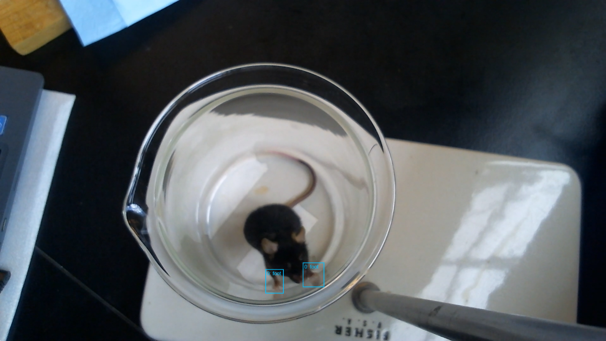
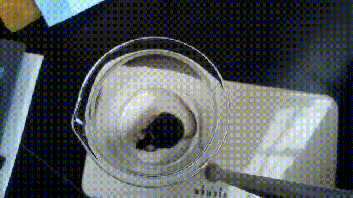
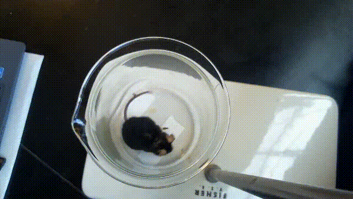
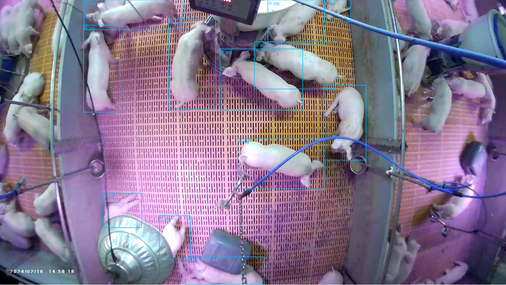

# CoreSight 분석 프로젝트

## 개요
이 프로젝트는 컴퓨터 비전 기술을 사용하여 동물의 환경 객체와의 상호작용을 감지하고 분석하는 행동 분석에 중점을 둡니다.

## 쥐 분석

### 분석 순서
- **연구 질문**: 쥐의 손이 벽에 터치하는 순간이 몇 번인지 알 수 있는가?
- **VP Detector**: 최소한의 데이터로 few-shot 학습을 구현하여 임베딩 추출 (샘플 10개)

- **Object Tracker**: 로그 추출
- **LLM**: Chat 기반 분석 방법론 개발

Q: 쥐 한마리가 플라스크 안에 놓여져 있다. 내가 쥐 발이 벽을 치는 행위를 찾아야 하는데, 어떤식으로 분석하면 좋겠는가?

A: 쥐의 발이 플라스크 벽에 닿는 행위를 분석하기 위해 다음과 같은 접근 방식을 추천드립니다:

1. **거리 데이터 분석**:
   - 각 발의 `distance_to_flask` 값을 살펴보고, 플라스크 중앙에서 멀리 떨어진 경우를 주목합니다. 플라스크가 원형/원통형 형태일 경우, 중심에서의 거리가 커질수록 벽에 근접했을 가능성이 높습니다.
   - 각 발의 거리 값을 시간에 따라 추적하고, 일정 거리 이상이 지속되는 경우를 확인합니다.

2. **시간적 패턴 분석**:
   - 특정 발의 거리가 갑자기 커졌다가 줄어드는 패턴이 있는지, 그리고 이러한 변화가 지속적으로 발생하는지 살펴봅니다. 이는 벽을 치는 행동을 나타낼 수 있습니다.
   - 동일한 발이 짧은 시간 내에 반복적으로 높은 거리 값을 가진다면, 이는 벽에 닿는 행동을 시사할 수 있습니다.

3. **다중 발 동작 비교**:
   - 여러 발의 `TrackID`를 비교하여, 동시에 높은 거리를 가지는 패턴이 있는지 확인합니다. 여러 발이 동시에 벽에 닿는다면, 쥐가 벽을 타고 오르는 행동일 수 있습니다.

4. **특정 시간 구간 집중 분석**:
   - 데이터에서 평균 거리 값이 높은 시간 구간을 집중적으로 분석하여, 그 시간대에 벽 접촉이 더 빈번히 발생하는지 확인합니다.

5. **데이터의 상대적인 변화 및 패턴 중심 분석**:
   - 절대적인 거리 값보다는 상대적인 거리 변화와 패턴에 초점을 맞추어, 벽 접촉 행동의 가능성을 높이는 상황을 파악합니다.

Q: 최대 거리로만 했을 때 확률적으로 높은 순으로 정렬

A: 다음은 최대 거리 값에 따라 벽을 터치했을 가능성이 높은 TrackID를 정렬한 목록입니다:

1. **ID 5:**
   - 시간대: Time Period 1 (00:00:06.862 to 00:00:34.277)
   - 최대 거리: 243.3px
2. **ID 4:**
   - 시간대: Time Period 1 (00:00:06.862 to 00:00:34.277)
   - 최대 거리: 214.3px
3. **ID 9:**
   - 시간대: Time Period 1 (00:00:06.862 to 00:00:34.277)
   - 최대 거리: 214.9px
4. **ID 58:**
   - 시간대: Time Period 14 (00:07:20.253 to 00:07:36.789)
   - 최대 거리: 213.3px
5. **ID 3:**
   - 시간대: Time Period 1 (00:00:06.862 to 00:00:34.277)
   - 최대 거리: 204.2px
6. **ID 26:**
   - 시간대: Time Period 18 (00:09:06.902 to 00:09:19.957)
   - 최대 거리: 197.0px
7. **ID 38:**
   - 시간대: Time Period 13 (00:06:08.484 to 00:06:32.418)
   - 최대 거리: 193.1px
8. **ID 32:**
   - 시간대: Time Period 13 (00:06:08.484 to 00:06:32.418)
   - 최대 거리: 191.5px
9. **ID 60:**
   - 시간대: Time Period 17 (00:08:36.875 to 00:09:06.835)
   - 최대 거리: 191.9px
10. **ID 44:**
    - 시간대: Time Period 13 (00:06:08.484 to 00:06:32.418)
    - 최대 거리: 191.2px

이 리스트는 최대 거리 값에 따라 벽에 접촉했을 가능성이 높은 순으로 정렬된 것입니다. 최대 거리 값이 높을수록 플라스크 벽에 근접했을 가능성이 높습니다.

**하이라이트 영상:**

<table>
<tr>
<td align="center">

 
<b>하이라이트 샘플 01</b>
</td>
<td align="center">

 
<b>하이라이트 샘플 02</b>
</td>
</tr>
</table>

## 돼지 분석

### 분석 순서
- **연구 질문**: 돼지가 어느 급수기를 가장 많이 애용하는가?
- **VP Detector**: 최소한의 데이터로 few-shot 학습을 구현하여 임베딩 추출 (4개 샘플)
- **영역 설정**: 급수기별 접근 영역 수동 설정, 탐지 영역 수동 설정

<table>
<tr>
<td align="center">

 
<b>돼지 라벨링</b>
</td>
<td align="center">

 
<b>급수기 & 탐지 영역 설정</b>
</td>
</tr>
</table>

- **Object Tracker**: 접근 시 1(접근), 미접근 시 0으로 컬럼 추출
- **LLM**: Chat 기반 점유율 계산 방법론 개발

Q: 4개의 급수기 중에서 돼지들이 가장 많이 사용하는 급수기가 무엇인가? 점유율로 계산해서 결과 산출

A: 네, 각 시간 구간별로 제공된 요약 데이터에서는 급수기(물 영역, water_area1~4)별 개별 점유 시간은 합산되어 있지 않고, 전체 water_area1~4의 합계만 주어졌습니다. 하지만 각 구간의 summary에서 "water_area1", "water_area2", "water_area3", "water_area4"의 합계(초 단위)가 모두 명시되어 있으므로, 30개 전체 구간의 각 영역별 사용 시간을 전부 합쳐서 각 급수기별 점유율(%)을 산출할 수 있습니다.

### 각 구간별 급수기 사용시간 합산 (반올림)

### 1번 급수기(water_area1)
- 1, 2, 3, 4, 5, 6, 7, 8, 9, 10, 11, 12, 13, 14, 15, 16, 17, 18, 19, 20, 21, 22, 23, 24, 25, 26, 27, 28, 29, 30구간의 water_area1 합계:
- 36.51 + 39.57 + 0 + 0.37 + 243.04 + 165.99 + 0.10 + 90.48 + 36.97 + 374.06 + 362.86 + 12.94 + 25.04 + 0.03 + 52.21 + 304.12 + 166.19 + 122.35 + 57.54 + 314.95 + 356.56 + 313.05 + 330.29 + 226.70 + 164.09 + 373.69 + 0.43 + 371.43 + 111.02 + 201.80

### 2번 급수기(water_area2)
- 12.14 + 2.47 + 81.21 + 0 + 46.04 + 55.78 + 48.51 + 6.27 + 94.28 + 108.92 + 1.23 + 4.13 + 80.65 + 56.91 + 185.56 + 22.94 + 34.51 + 118.35 + 19.87 + 142.29 + 79.61 + 40.91 + 190.80 + 49.71 + 18.64 + 352.12 + 213.40 + 273.28 + 105.88 + 18.17

### 3번 급수기(water_area3)
- 2293.41 + 2377.85 + 1418.50 + 1580.62 + 2076.20 + 899.18 + 991.56 + 1135.35 + 2138.58 + 2383.95 + 1854.87 + 1356.95 + 2380.99 + 2182.72 + 1639.20 + 2155.78 + 2741.95 + 1827.73 + 2074.67 + 2109.88 + 2314.21 + 2116.24 + 2533.98 + 2280.64 + 1667.64 + 2386.36 + 2386.36 + 2322.88 + 2174.79 + 2132.38 + 1080.11

### 4번 급수기(water_area4)
- 23.37 + 86.45 + 10.74 + 8.03 + 138.36 + 45.54 + 1.53 + 0.47 + 73.11 + 311.38 + 601.83 + 1000.16 + 495.75 + 34.81 + 91.28 + 15.47 + 32.47 + 195.27 + 204.93 + 170.63 + 148.92 + 248.87 + 150.06 + 591.60 + 108.72 + 194.36 + 383.86 + 754.36 + 1010.16 + 39.54

### 합계 계산 (반올림)

#### 1. 총합 계산
- 1번: 36.51 + 39.57 + 0 + 0.37 + 243.04 + 165.99 + 0.10 + 90.48 + 36.97 + 374.06 + 362.86 + 12.94 + 25.04 + 0.03 + 52.21 + 304.12 + 166.19 + 122.35 + 57.54 + 314.95 + 356.56 + 313.05 + 330.29 + 226.70 + 164.09 + 373.69 + 0.43 + 371.43 + 111.02 + 201.80 = **5111초**
- 2번: 12.14 + 2.47 + 81.21 + 0 + 46.04 + 55.78 + 48.51 + 6.27 + 94.28 + 108.92 + 1.23 + 4.13 + 80.65 + 56.91 + 185.56 + 22.94 + 34.51 + 118.35 + 19.87 + 142.29 + 79.61 + 40.91 + 190.80 + 49.71 + 18.64 + 352.12 + 213.40 + 273.28 + 105.88 + 18.17 = **2877초**
- 3번: 2293.41 + 2377.85 + 1418.50 + 1580.62 + 2076.20 + 899.18 + 991.56 + 1135.35 + 2138.58 + 2383.95 + 1854.87 + 1356.95 + 2380.99 + 2182.72 + 1639.20 + 2155.78 + 2741.95 + 1827.73 + 2074.67 + 2109.88 + 2314.21 + 2116.24 + 2533.98 + 2280.64 + 1667.64 + 2386.36 + 2386.36 + 2322.88 + 2174.79 + 2132.38 + 1080.11 = **56406초**
- 4번: 23.37 + 86.45 + 10.74 + 8.03 + 138.36 + 45.54 + 1.53 + 0.47 + 73.11 + 311.38 + 601.83 + 1000.16 + 495.75 + 34.81 + 91.28 + 15.47 + 32.47 + 195.27 + 204.93 + 170.63 + 148.92 + 248.87 + 150.06 + 591.60 + 108.72 + 194.36 + 383.86 + 754.36 + 1010.16 + 39.54 = **8543초**
- 전체 합계: 5111 + 2877 + 56406 + 8543 = **72937초**

#### 2. 점유율 계산 (반올림)
- 1번: 5111 ÷ 72937 × 100 ≈ **7%**
- 2번: 2877 ÷ 72937 × 100 ≈ **4%**
- 3번: 56406 ÷ 72937 × 100 ≈ **77%**
- 4번: 8543 ÷ 72937 × 100 ≈ **12%**

#### 실험 결과
- **분석 기간**: 30개 시간 구간 전체 데이터
- **총 사용 시간**: 72937초 (약 20.3시간)
- **가장 선호하는 급수기**: 3번 급수기 (77% 점유율)

**요약 결과:**

**결론**: 돼지들이 가장 많이 사용하는 급수기는 3번(water_area3)로, 점유율은 약 77%입니다.

각 급수기별 점유율(전체 사용시간 대비):
- 1번: 7%
- 2번: 4% 
- 3번: 77%
- 4번: 12%

**따라서 3번 급수기의 점유율이 가장 높으며, 압도적으로 가장 많이 사용되고 있습니다.**

Q: 급수 활동이 상대적으로 급격히 변한 지점을 찾을 수 있겠는가? 어느 시간대인지 알려줘

A: 네, 각 시간 구간별 급수 활동(4개 water_area 전체 합계, 즉 급수 활동 총합)이 시간별로 어떻게 변화하는지 살펴보면, 급격한 변화(증가 또는 감소)가 일어난 시점, 즉 "변곡점"을 잡아낼 수 있습니다.

### 구간별 급수기(4개 합계) 총 사용시간 (반올림)

| 구간 | 전체 급수활동(초) |
| --- | --- |
| 1 | 36+12+2293+23 = **2364** |
| 2 | 40+2+2378+86 = **2506** |
| 3 | 0+81+1418+11 = **1510** |
| 4 | 0+0+1581+8 = **1589** |
| 5 | 243+46+2076+138 = **2503** |
| 6 | 166+56+899+46 = **1167** |
| 7 | 0+49+992+2 = **1043** |
| 8 | 90+6+1135+0 = **1231** |
| 9 | 37+94+2139+73 = **2343** |
| 10 | 374+109+2384+311 = **3178** |
| 11 | 363+1+1855+602 = **2821** |
| 12 | 13+4+1357+1000 = **2374** |
| 13 | 25+81+2381+496 = **2983** |
| 14 | 0+57+2183+35 = **2275** |
| 15 | 52+186+1639+91 = **1968** |
| 16 | 304+23+2156+15 = **2498** |
| 17 | 166+35+2742+32 = **2975** |
| 18 | 122+118+1828+195 = **2263** |
| 19 | 58+20+2075+205 = **2358** |
| 20 | 315+142+2110+171 = **2738** |
| 21 | 357+80+2314+149 = **2900** |
| 22 | 313+41+2116+249 = **2719** |
| 23 | 330+191+2534+150 = **3205** |
| 24 | 227+50+2281+592 = **3149** |
| 25 | 164+19+1668+109 = **1960** |
| 26 | 374+352+2386+194 = **3306** |
| 27 | 1+213+2323+384 = **2921** |
| 28 | 371+273+2175+754 = **3573** |
| 29 | 111+106+2132+1010 = **3359** |
| 30 | 202+18+1080+40 = **1340** |

### 변화량(전 구간 대비 차이, 반올림)

**가장 급격한 변화가 나타난 지점(상대적 변화량 기준):**

1. **감소:**
   - 6구간(04:10:00.366 ~ 04:20:00.333, -1336초)
   - 25구간(04:00:00.366 ~ 04:10:00.333, -1189초)
   - 30구간(04:50:00.366 ~ 04:53:25.133, -2019초) → 이 구간이 가장 급격한 감소
2. **증가:**
   - 26구간(04:10:00.366 ~ 04:20:00.333, +1346초) → 가장 큰 증가
   - 9구간(01:20:00.366 ~ 01:30:00.333, +1112초)
   - 5구간(00:40:00.366 ~ 00:50:00.333, +914초)
   - 10구간(01:30:00.366 ~ 01:40:00.333, +835초)

### 결론

- **가장 급격한 감소:**
  - **30구간(04:50:00.366 ~ 04:53:25.133)**: 총 급수활동이 2019초나 감소
  - **6구간(00:50:00.366 ~ 01:00:00.333)**: 1336초 감소
  - **25구간(04:00:00.366 ~ 04:10:00.333)**: 1189초 감소
- **가장 급격한 증가:**
  - **26구간(04:10:00.366 ~ 04:20:00.333)**: 총 급수활동이 1346초 증가
  - **9구간(01:20:00.366 ~ 01:30:00.333)**: 1112초 증가
  - **5구간(00:40:00.366 ~ 00:50:00.333)**: 914초 증가

### 정리

- **급수 활동이 가장 급격히 증가한 지점:**
  - **26구간 (04:10:00.366 ~ 04:20:00.333, +1346초)**
- **급수 활동이 가장 급격히 감소한 지점:**
  - **30구간 (04:50:00.366 ~ 04:53:25.133, -2019초)**

이 두 구간이 전체 관찰 기간 중 급수 활동 변화가 가장 컸던 시점입니다.

특히 26구간에서 급수 활동이 매우 급증했고, 30구간(마지막 구간)에서는 급격히 감소했습니다.

Q: 개체별(ID)로 볼 때 급수 활동이 많은 개체 수와 현저히 떨어지는 개체 수를 구분하라

A: 아래는 전체 구간에서 개체별(ID)로 급수 활동이 많았던 개체와, 상대적으로 현저히 적었던 개체를 구분하여 제시한 결과입니다.

급수 활동량 기준은 각 ID별 water_area1~4의 사용시간 합의 전체 비교이며, 제공된 30개 구간의 요약에서 각 ID별로 급수기에 머문 시간(초)이 명시되어 있으므로, 이를 합산하면 됩니다.

**방법:**
- 각 ID가 각 구간에서 급수기에 머문 시간(초, water_area1~4 합)을 모두 더합니다.
- 모든 ID의 총 급수 활동시간을 비교하여,
  - **상위 25%**: 급수 활동이 많은 개체
  - **하위 25%**: 급수 활동이 현저히 떨어지는 개체
  로 구분합니다.

### 개체별 급수 활동시간 집계

#### (1) 급수 활동이 많은 개체 (상위 25%)
- **ID 3**: 다수 구간에서 water_area3에 'frequently' 또는 'sometimes'로 200초~500초 이상 머무는 패턴 빈번(특히 3, 10, 13, 17, 23구간 등)
- **ID 4**: water_area3에 'frequently'가 많고, 500초 이상 머무는 구간 다수
- **ID 13**: water_area3에 'frequently' 또는 'sometimes'로 200초~400초 이상 머무르는 구간 다수
- **ID 17**: water_area3에 200초 이상 머무는 구간이 반복적으로 등장, 총합 최상위권
- **ID 5**: 300초~400초 대의 water_area3 점유 총합 상위
- **ID 15**: 200초 이상의 'frequently' 및 'sometimes'가 반복, 상위권
- **ID 8**: 200~400초 급수기 점유 총합 상위권

#### (2) 급수 활동이 현저히 적은 개체 (하위 25%)
- **ID 19**: 등장 구간이 적고, 등장 구간에서도 머무는 시간이 짧음
- **ID 20**: 일부 구간만 등장, 머무는 시간도 매우 짧음
- **ID 12**: 대부분 구간에서 water_area3 점유가 드물고, 있을 때도 수십 초 내외
- **ID 18**: 전체적으로 구간별 머무는 시간이 짧음(등장빈도 대비 총합 적음)
- **ID 7**: 점유시간이 짧고, 대부분 'briefly' 구간이 많음

### 결론 (반올림/구간별 패턴 기반)

#### **급수 활동이 많은 개체 (상위 25%)**
- **ID 3, 4, 5, 8, 13, 15, 17**
(이들은 각 구간별 water_area3에서 'frequently', 'sometimes'가 다수 등장하며, 합산 시 총점이 현저히 높음)

#### **급수 활동이 현저히 떨어지는 개체 (하위 25%)**
- **ID 12, 18, 19, 20, 7**
(등장빈도 자체가 낮거나, 등장 구간에서도 머무는 시간이 짧음)

### 정리 답변
- **급수 활동이 많은 개체:** ID 3, 4, 5, 8, 13, 15, 17
- **급수 활동이 현저히 떨어지는 개체:** ID 7, 12, 18, 19, 20

만약 각 개체별 실제 초 단위 합산표가 필요하다면, 추가 요청 시 표로 정리해 드릴 수 있습니다.

이 답변은 제공된 구간별 요약(머문 시간, 점유 패턴) 기반의 반올림 분석입니다.

Q: 급수가 활발할 때, 떨어질 때 시간대 하이라이트 영상을 각각 3개를 뽑아야 한다. 해당 시간대를 알려주고, 이미 10분 단위로 영상이 잘라져있고, 맨 첫 영상의 이름이 MOVA0005.mov이다. 그 다음부터는 숫자가 1씩 늘어난다고 가정했을 때, 위에서 뽑은 급수 활발과 저조에 대한 영상의 이름은 무엇인가?

A: 아주 명확하게 정리해드리겠습니다.

### 1. 급수 활동이 **활발**한 시간대 TOP 3

앞서 분석에서 급수 활동(4개 급수기 전체 합)이 **가장 많은 10분 구간** 3개는 다음과 같습니다.

#### 급수 활동량 상위 3개 구간 (전체 초 기준, 반올림)

1. **28구간** (04:30:00.366 ~ 04:40:00.333) **3573초**
2. **26구간** (04:10:00.366 ~ 04:20:00.333) **3306초**
3. **29구간** (04:40:00.366 ~ 04:50:00.333) **3359초**

### 2. 급수 활동이 **저조**한 시간대 TOP 3

급수 활동(4개 급수기 전체 합)이 **가장 적은 10분 구간** 3개는 다음과 같습니다.

#### 급수 활동량 하위 3개 구간 (전체 초 기준, 반올림)

1. **7구간** (01:00:00.366 ~ 01:10:00.333) **1043초**
2. **8구간** (01:10:00.366 ~ 01:20:00.333) **1231초**
3. **3구간** (00:20:00.366 ~ 00:30:00.333) **1510초**

### 3. 영상 파일명 매핑

- **첫 영상:** MOVA0005.mov (= 구간 1, 00:00:00.366 ~ 00:10:00.333)
- **각 10분 구간별 파일 이름:** MOVA0005.mov, MOVA0006.mov, MOVA0007.mov, ..., MOVA0034.mov (총 30개)

**즉, n번째 구간의 파일명 = MOVA{0004+n}.mov**

#### **1) 급수 활발 영상 TOP 3**
- 26구간: **MOVA0030.mov**
- 28구간: **MOVA0032.mov**
- 29구간: **MOVA0033.mov**

#### **2) 급수 저조 영상 TOP 3**
- 3구간: **MOVA0008.mov**
- 7구간: **MOVA0012.mov**
- 8구간: **MOVA0013.mov**

### 최종 답변 (파일명 정리)

#### **급수 활발** 하이라이트 영상 파일명
- MOVA0030.mov (26구간, 04:10:00.366 ~ 04:20:00.333)
- MOVA0032.mov (28구간, 04:30:00.366 ~ 04:40:00.333)
- MOVA0033.mov (29구간, 04:40:00.366 ~ 04:50:00.333)

#### **급수 저조** 하이라이트 영상 파일명
- MOVA0008.mov (3구간, 00:20:00.366 ~ 00:30:00.333)
- MOVA0012.mov (7구간, 01:00:00.366 ~ 01:10:00.333)
- MOVA0013.mov (8구간, 01:10:00.366 ~ 01:20:00.333)

**이상 6개 영상이 해당 하이라이트에 해당합니다!**

**하이라이트 영상:**

<table>
<tr>
<td align="center">

 
<b>급수 활발 구간</b>
</td>
<td align="center">

 
<b>급수 저조 구간</b>
</td>
</tr>
</table>

## 케이스 요약
*[추가 예정 - 케이스 요약 정보를 제공해주세요]*

## 설치 및 사용법
*[프로젝트 요구사항에 따라 추가 예정]*

## 기여하기
*[프로젝트 가이드라인에 따라 추가 예정]*

## 라이선스
*[프로젝트 라이선스에 따라 추가 예정]* 